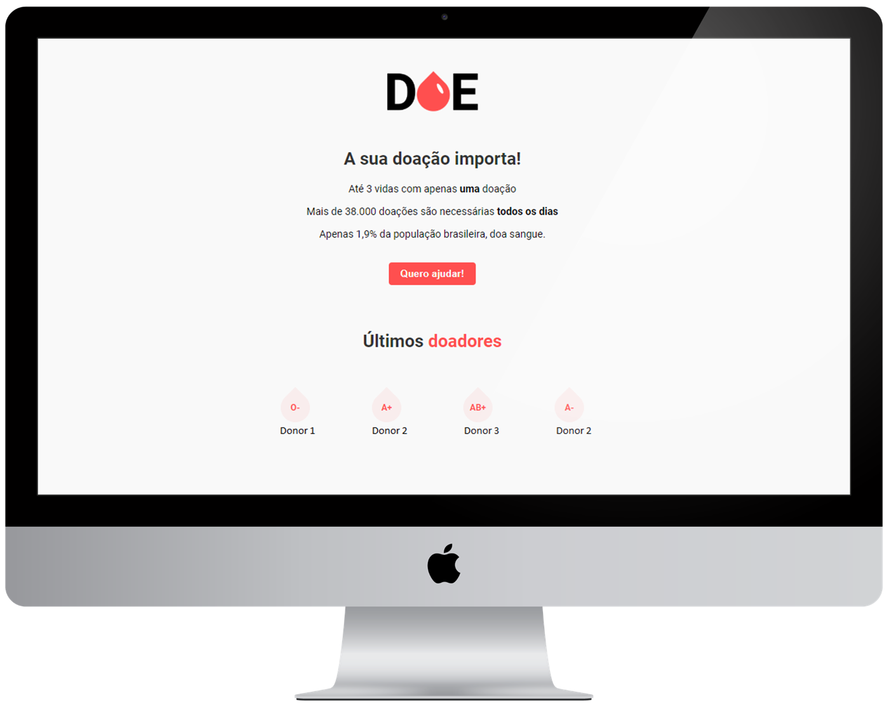

<h1 align="center">
    
</h1>

<p align="center">
  <a href="#-Project">Project</a>&nbsp;&nbsp;&nbsp;|&nbsp;&nbsp;&nbsp;
  <a href="#-Technology">Technology</a>&nbsp;&nbsp;&nbsp;|&nbsp;&nbsp;&nbsp;
  <a href="#-License">License</a>&nbsp;&nbsp;&nbsp;|&nbsp;&nbsp;&nbsp;
  <a href="#-DataBase">DataBase</a>&nbsp;&nbsp;&nbsp;|&nbsp;&nbsp;&nbsp;
  <a href="#-VSCode">Running Environment</a>
</p>

<p align="center">
  
</p>

<br>

<p align="center">
  
</p>

## 💻 Project

<strong>DOE</strong> is an blood donor registration system. 💉

Web application created in [@Rocketseat's](https://github.com/Rocketseat) third edition MarathonDev, an online event that occurred on February 17th to 21th, 2020.

## 📀 Technology

- [HTML5](https://developer.mozilla.org/en-US/docs/Web/Guide/HTML/HTML5)
- [CSS3](https://developer.mozilla.org/en-US/docs/Archive/CSS3)
- [JavaScript](https://developer.mozilla.org/en-US/docs/Web/JavaScript)
- [Node.js](https://nodejs.org/en/)
- [Express](https://expressjs.com/pt-br/)
- [Nodemon](https://www.npmjs.com/package/nodemon)
- [Nunjucks](https://www.npmjs.com/package/nunjucks)

<br>

## 📕 License

This project is licensed under the MIT [LICENSE](LICENSE.md).

<br>

## 📂 DataBase

❗ Instalation Required ❗ 

1. Download PostgreeSQL:
```bash 
https://www.postgresql.org/download/
```
2. Download and install the visual client (postbird):
```bash 
https://www.electronjs.org/apps/postbird
```
3. Now you are able to create and edit an Data Base.
```bash 
 - create database named "doe"
 - create table named "donors"
 - create fields "name" , "email" , "blood"
```
4. Setup Data Base configuration:
```bash
const db = new pool({   
user: 'postgres',   //username   
password: '0000',   //password   
host: 'localhost',  //host 
port: 3300,         //port  
database: 'doe'     //Data Base name.
})
```
## 💎 VSCode

Start Dev Environment for <strong>VSCode</strong>

1. Clone the repository: 
```bash 
git@github.com:CaioLemec/donate-blood-app.git
```
2. Install node: 
```bash
 https://nodejs.org/en/
 ```
3. Open project folder in VSCode:
```bash
 cd ../donate-blood-app.git -> then -> code .
 ```
4. Install dependencies by using command:
```bash
 npm install
 ```
5. This dependencies are required:
```bash
 express (web server)
 nodemon (automatically restart your server)
 nunjucks (template engine)
 ```
6. At your terminal set this command line:
```
bash npm start
```
<hr>
<br>

<p align="center">🎈 developed by Caio Lemec 🎈 </p>

